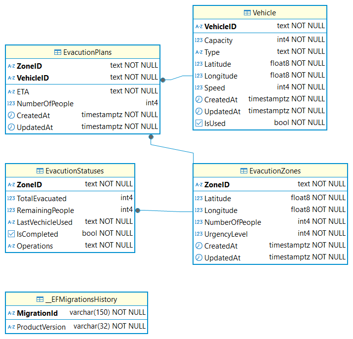

# EvacuationPlanning Rest API 🌎
## Overview 🎯
- Project จัดการการอพยพ โดย จัดการ ยานพาหนะแต่ละเส้นทาง และ ตำแหน่งของผู้ต้องการอพยพ ตามความจุของยานพาหนะ และ     คำนวนเวลาในการเดินทาง (ETA) และ แสดงสถานะแบบ Real-Time
## Getting Started 🚀
- Build & Run (Local Development)
    - Run `docker compose up -d && dotnet watch --project src/EvacutionPlanningAndMonitoring.App.API`
## DataBase Sections ℹ️
- Relationship
  - EvacuationPlan มีความสัมพันธ์ แบบ Many-to-Many กับ ตาราง EvacutionZone และ Vehicle โดยมี ZoneID และ VehicleID เป็น CompositeKey เป็นตารางเชื่อม
  - EvacutionStatus มีความสัมพันธ์ แบบ One-to-One กับ ตาราง EvacutionZone โดยมี FK เป็น ZoneID
- ER Diagrams

  

## Folder Structure 📁
- Controllers/
    - เก็บ API Endpoints สำหรับรับคำขอจาก client และส่งต่อไปยัง Services
- Data/
    - จัดเก็บ `DbContext` สำหรับ Entity Framework Core ที่ใช้เชื่อมต่อกับฐานข้อมูล
- DTOs/
    - เก็บ Data Transfer Objects สำหรับ mapping ข้อมูลระหว่าง Controller และ Service Layer
- Extensions/
    - เก็บ Extension Methods เช่นการ Register DI ของ Services, Repositories
- Helpers/
    - รวมฟังก์ชันช่วยเหลือ เช่น `HaversineFormula` สำหรับคำนวณระยะทางระหว่างพิกัด GPS
- Middlewares/
    - เก็บ Custom Middleware ต่าง ๆ ที่ใช้ในระบบ เช่น Error Handling
- Models/
    - เก็บ Entity Models (ใช้ร่วมกับ EF Core)
- Repositories/
    - จัดการการเข้าถึงข้อมูล (Data Access Layer) เช่น CRUD กับฐานข้อมูล โดยแยกจาก Business Logic
-  Services/
    - เก็บ Business Logic หลักของระบบ การเพิ่ม ยาพาหนะ, การเพิ่มจุดที่ต้องการอพยพ การสร้าง Planing, การจัดการสถานะต่าง Status, การคำนวณ ETA, และ Workflow ต่าง ๆ
## Tech Stack 🧰
- Backend Framework
    -  ASP.NET Core (.NET 9) 
- ORM / Database
    - Entity Framework Core + PostgreSQL
- Caching
    - Redis
- Logging
    - Serilog
